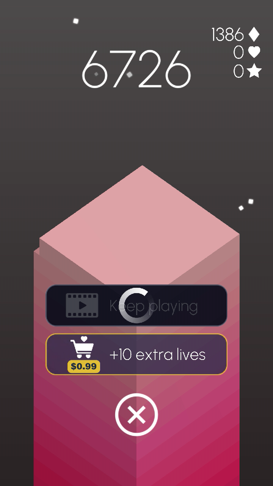

# stack-bot

[](https://www.python.org/) [](https://play.google.com/store/apps/details?id=com.ketchapp.stack) [](https://apps.apple.com/us/app/stack/id1080487957)

## Record 
[](https://www.youtube.com/watch?v=KhcfCGIby-4)



## Features

- Click once to set the auto-click position
- Configurable click intervals via `config.json`
- Real-time click counter
- Press 'q' to exit anytime

## Installation

1. Clone this repository:
```bash
git clone https://github.com/letian-j/stack-bot.git
cd stack-bot
```

2. Install required dependencies:
```bash
pip install pyautogui pynput
```

## Usage

1. Run the script:
```bash
python main.py
```

2. Click anywhere on the screen to set the auto-click position
3. The bot will start clicking automatically after a brief delay
4. Press 'q' to stop

## Configuration

Edit `config.json` to customize timing:

```json
{
  "start_delay": 0.8,      // Delay before first cube (seconds)
  "click_interval": 0.7    // Time between clicks (seconds)
}
```

## Requirements

- Python 3.6+
- pyautogui
- pynput

## License

See [LICENSE](LICENSE) file for details.
